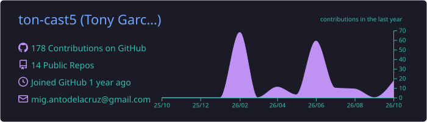
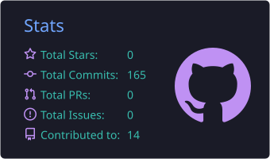
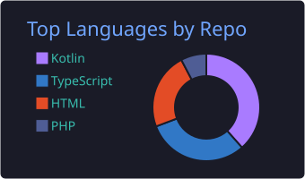
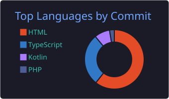

<!-- ===================== HEADER ===================== -->

  

  

  
  
  

  

<!-- ===================== SOBRE MÍ ===================== -->
## 👨‍💻 Sobre mí

Soy **estudiante de Ingeniería en Sistemas Computacionales y Software Developer**, enfocado en construir soluciones tecnológicas que resuelvan problemas reales.

Me interesa especialmente el **desarrollo web, automatización, bases de datos, redes, infraestructura e inteligencia artificial**. Actualmente trabajo en proyectos propios y académicos donde combino software con necesidades de entornos reales, buscando transformar procesos manuales en sistemas más eficientes.

  

<!-- ===================== LO QUE HAGO ===================== -->
## 🚀 Lo que hago

<table>
  <tr>
    <td width="50%" valign="top">

- 💻 Desarrollo de **aplicaciones web** y sistemas de gestión.
- 🗄️ Diseño, integración y manejo de **bases de datos**.
- 🌐 **Redes, fibra óptica** e infraestructura ISP.
- 🤖 Exploración e integración de **Inteligencia Artificial**.

</td>
    <td width="50%" valign="top">

- ⚙️ **Automatización** de procesos y herramientas internas.
- 📊 Desarrollo de soluciones **orientadas a datos**.
- 🔧 Construcción, **despliegue y mantenimiento** de proyectos reales.
- 📱 Apps móviles **Android** con Kotlin.

</td>
  </tr>
</table>

<!-- ===================== TECNOLOGÍAS ===================== -->
## 🛠️ Tecnologías

  
   
  

| Área | Stack |
| :--- | :--- |
| **Lenguajes** | Python · JavaScript · TypeScript · Kotlin · SQL · HTML · CSS |
| **Backend** | Flask · APIs REST |
| **Bases de datos** | PostgreSQL · MySQL · Supabase |
| **Frontend** | HTML · Tailwind CSS |
| **Móvil** | Kotlin · Android Studio |
| **Infraestructura** | Git · GitHub · Vercel · Redes · Fibra óptica |
| **Otros** | IA · Automatización · Linux / Windows · Desarrollo de servicios |

  

<!-- ===================== PROYECTOS ===================== -->
## 🔥 Proyecto destacado

<table>
  <tr>
    <td>

### 📡 Fibra Manager

Plataforma desarrollada para **gestionar la infraestructura de fibra óptica de una red ISP**: clientes, NAPs, mediciones, inventarios y documentación. Lleva procesos que antes se realizaban de forma manual hacia una **solución digital centralizada**.

  
  
  
  
  

</td>
  </tr>
</table>

### 📂 Otros repositorios

  
  
  
  
  

> 💡 Mi objetivo no es solamente aprender tecnología, sino **crear software que pueda utilizarse en el mundo real**.

  

<!-- ===================== ESTADÍSTICAS ===================== -->
## 📊 Estadísticas

  

  
  
  

  

  

<!-- ===================== SNAKE ===================== -->

  <picture>
    <source media="(prefers-color-scheme: dark)" srcset="https://raw.githubusercontent.com/ton-cast5/ton-cast5/output/github-snake-dark.svg"/>
    <source media="(prefers-color-scheme: light)" srcset="https://raw.githubusercontent.com/ton-cast5/ton-cast5/output/github-snake.svg"/>
    
  </picture>

<!-- ===================== FOOTER ===================== -->
<h3 align="center">⚡ Build. Learn. Solve. Repeat. ⚡</h3>

  

